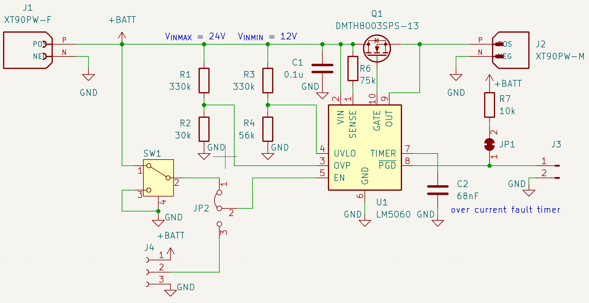
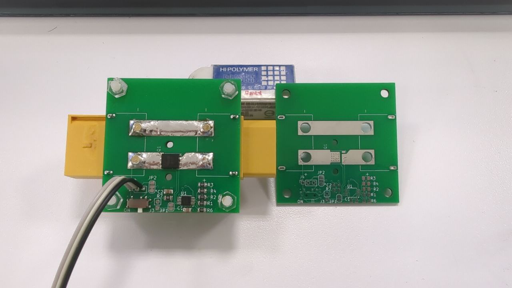
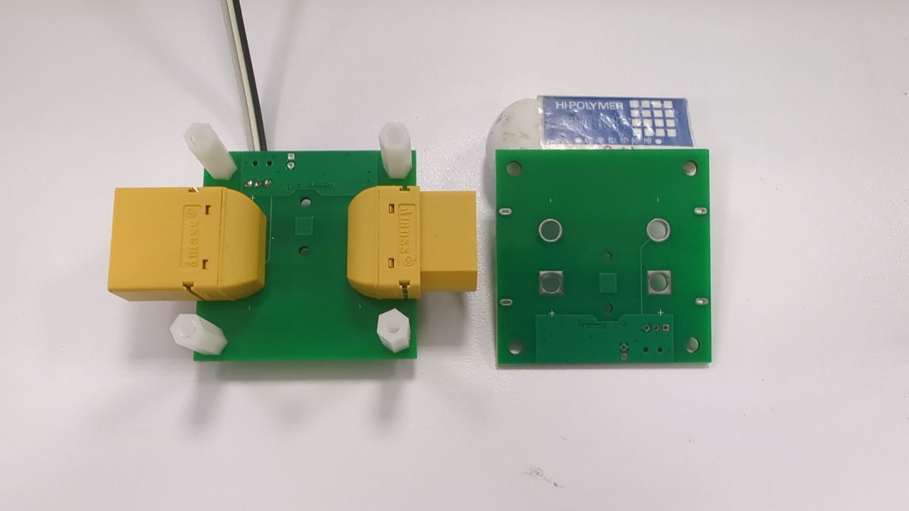

# ESwitch

This is a high-side N-channel MOSFET electrical switch module. The power MOSFET (DMTH8003SPS) is driven by a high-side protection controller (LM5060). The schematics and PCB layout are designed in KiCad and available in the kicad directory. All the components are available in LCSC at least at the time of writing. It is also designed for single-sided PCBA with a few exceptions in the high current traces because you'll want them to be reinforced. Plus, I doubt XT90 can be assembled by cheap PCBAs anyway. There are also some Python utilities which are helpful for you to determine the required component values for various protections provided by the LM5060. In short:

- Calculate the required component values for the LM5060 with the help of programs in `utils`.
- Modify and generate the necessary manufacturing files in `kicad`.
- Have the PCB manufactured and assembled if you desire.
- Assemble the module with the instructions in `assemble`. You can also find the BOM there.

## TODO
- [ ] Fix XT90 socket and plug polarity
- [x] Add LCSC part numbers into schematics
- [ ] Add assemble instructions
- [ ] Add test results

## Debug Notes

I should have positioned the high-current traces on the bottom layer, allowing for reinforcement by adding solder or copper plates onto them.

Fortunately, by chance, I made a mistake with the XT90 socket and plug. Consequently, I can easily swap the socket and plug, relocating them to the back side of the board, thereby preventing any interference with the high-current traces.

## Assembled Module

Not the prettiest welding nor photography, but it works. You get the idea of the bugs that canceled each other out. The XT90s were meant to be on the top side, but the polarity (socket and plug) was wrong. In order to get the polarity (socket, plug) right, the XT90s need to be positioned on the bottom side when swapped, which luckily achieved the desired outcome (leaving top traces for reinforcement).

## Notes

2024-03-13: I have a module that has become consistently conductive. Electrostatic discharge (ESD) is suspected as the cause, especially considering it was originally functioning properly.